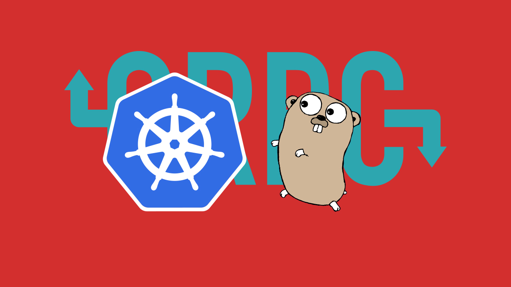

# Getting Started with Microservices using Go, gRPC and Kubernetes

<p align="center">
  
</p>

Source code for [Getting Started with Microservices using Go, gRPC and Kubernetes](https://outcrawl.com/getting-started-microservices-go-grpc-kubernetes/) article.

## Building

Switch to Docker daemon inside Minikube VM:

```
$ eval $(minikube docker-env)
```

Build images and deploy to Kubernetes cluster:

```
$ ./build.sh
```

Try it out.

```
$ curl $(minikube service api-service --url)/gcd/294/462
```
